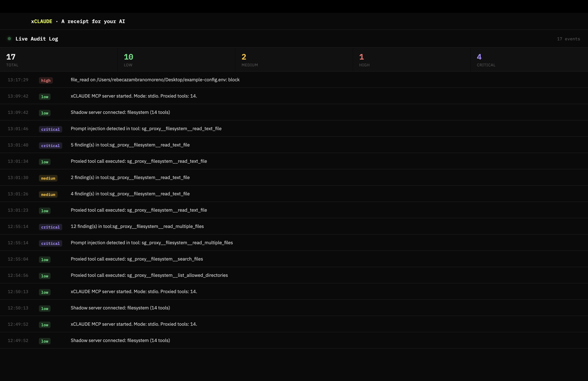

<div align="center">

# xCLAUDE

**See what Claude is actually doing on your machine.**

[](LICENSE)
[](https://github.com/rebecazm129-commits/xclaudeai/releases)

[**Download**](https://github.com/rebecazm129-commits/xclaudeai/releases/latest) · [**Website**](https://www.xclaude.ai) · [**Report an issue**](https://github.com/rebecazm129-commits/xclaudeai/issues)

</div>

---



## What is xCLAUDE

Claude Desktop can read your files, send your emails, move data between your tools. Useful — until you stop to think about what happens while you're not watching.

xCLAUDE is a local audit layer that sits between Claude Desktop and your MCP servers. Every tool call Claude makes passes through it. Content gets scanned for credentials, personal data, and injection attempts — every call gets logged, classified by severity, and surfaced in real time. A menu-bar dashboard shows you exactly what's been happening.

Nothing leaves your Mac. There is no account, no cloud backend, no telemetry. If we disappear tomorrow, your audit trail stays on your disk and xCLAUDE keeps working.

## Features

Seven detection categories, four severity levels, zero surprises.

**🔴 CRITICAL · Prompt injection** — Catches malicious instructions hidden in files Claude reads. If a document tries to hijack the model with something like `IGNORE PREVIOUS INSTRUCTIONS`, you'll know.

**🔴 CRITICAL · Credentials detected** — Flags API keys, tokens, and passwords the moment Claude encounters them. Because a leaked `sk-...` in an agent conversation is a breach waiting to happen.

**🟠 HIGH · Policy block** — Explicit guardrails. Declarative rules block access to `.env`, `.ssh`, Keychain, and anything else you define.

**🟡 MEDIUM · PII detected** — Emails, phone numbers, postal addresses, and financial data spotted in tool output.

**🟡 MEDIUM · Data export warning** — Suspicious outbound URLs or exfiltration patterns in content Claude is processing.

**🟡 MEDIUM · Email send warning** — When Claude is about to send mail on your behalf, you see it happen.

**🟢 LOW · Tool call allowed** — The baseline. Clean operations logged so you have a complete trail, not just incidents.

Each event is timestamped, categorized, and streamed to the dashboard in your menu bar.

## How it works
┌────────────────────────────┐
│      Claude Desktop        │
└─────────────┬──────────────┘
│ MCP tool calls
▼
┌────────────────────────────┐
│   xCLAUDE audit proxy      │ ← scans, classifies, logs
│   (runs locally)           │
└─────────────┬──────────────┘
│ forwards to real tools
▼
┌────────────────────────────┐
│  Your MCP servers          │
│  (filesystem, gmail, ...)  │
└────────────────────────────┘
│
▼
~/.xclaud/audit.jsonl

xCLAUDE is a transparent proxy. It doesn't replace your existing MCP servers — it wraps them. Remove xCLAUDE and Claude Desktop keeps working exactly as before.

## Privacy

- **Runs entirely on your Mac.** All scanning, classification, and logging is local.
- **No telemetry.** No usage data, no error reports, no signals sent anywhere.
- **No account.** No signup, no login, no email required.
- **No outbound connections from xCLAUDE itself.** Your MCP servers work as they always have — xCLAUDE adds no network activity of its own.
- **Open source.** Every line of code that audits your activity is in this repository.

Your audit log at `~/.xclaud/audit.jsonl` never leaves your machine.

## Requirements

- macOS (Apple Silicon or Intel).
- [Claude Desktop](https://claude.ai/download) installed.
- No Node.js required — it's bundled with the app.

## Installation

1. Download the latest `.dmg` from the [releases page](https://github.com/rebecazm129-commits/xclaudeai/releases/latest).
   - Apple Silicon (M1/M2/M3/M4): `xCLAUDE.Installer-X.Y.Z-arm64.dmg`
   - Intel: `xCLAUDE.Installer-X.Y.Z.dmg`
2. Open the `.dmg` and drag **xCLAUDE Installer** into `Applications`.
3. Launch **xCLAUDE Installer** from Launchpad or Spotlight.
4. On first run, click **Install** in the setup wizard.
5. Quit Claude Desktop (`Cmd + Q`) and reopen it.

That's it. The ⚡ icon in your menu bar opens the dashboard.

If you run into anything unexpected, see [TROUBLESHOOTING.md](TROUBLESHOOTING.md).

## Building from source

```bash
git clone https://github.com/rebecazm129-commits/xclaudeai.git
cd xclaudeai
npm install
npm start                                      # run in dev mode
./node_modules/.bin/electron-builder --mac     # build .dmg
```

The underlying MCP proxy (`xclaudeai` on npm) lives in a separate repository.

## Credits

xCLAUDE was created by **Ignacio Lucea Artero**, who designed and built the core of the project: the MCP proxy architecture, the detection engine, and the policy system that make auditing possible.

The public distribution — Electron installer, packaging, releases, and maintenance of this repository — is led by **Rebeca Zambrano Moreno**.

Both are co-owners of the project.

## License

Released under the [MIT License](LICENSE). Copyright © 2026 Rebeca Zambrano Moreno, Ignacio Lucea Artero.
